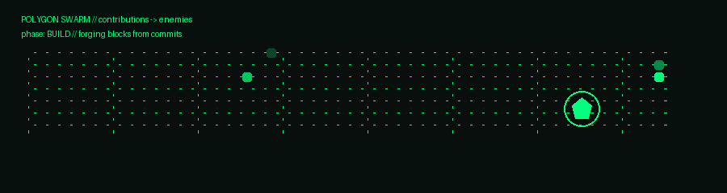

# 🛡️ GERARD VINCE LILLO  
### Offensive Security | Security Automation | Cloud & Detection Engineering

## Focus
- **Detection & response workflows** (SOC/XDR investigation, tuning, containment)
- **Cloud security controls** (AWS secure pipelines & guardrails)
- **Security automation** (Python tooling, parsing, reporting)

## Highlights
- **Trend Micro Vision One (XDR):** triage → investigate → contain, detection tuning, false-positive reduction  
- **Trend Micro FSS on AWS:** CloudFormation deploy + S3 scanning pipeline (clean → clean bucket, malicious → quarantine bucket)

## Projects
- **GuardSweep** — security automation & monitoring toolkit (Python)

## Contact
Website: https://gerardvincelillo.com  
LinkedIn: https://www.linkedin.com/in/gerard-vince-lillo/

---

### 🎮 Polygon Survivors (Profile Vignette)

