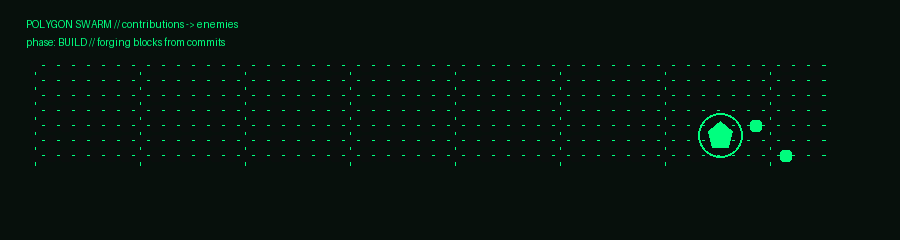

# Gerard Vince Lillo
### Security automation, defensive tooling, and practical privacy engineering

## About Me

I'm a security engineer focused on building tools and workflows that are usable in real environments, not just good in demos.

Most of my work sits at the intersection of:

- defensive security tooling
- privacy-focused engineering
- security automation
- cloud and detection workflows

I like turning noisy manual processes into systems that are clearer to operate, easier to trust, and faster to improve.

## Current Focus

### Parasideum

Parasideum is my flagship project: a local-first defensive security agent and operator terminal for endpoint telemetry, drift review, persistence analysis, and privacy posture.

- Built for explainable defensive visibility instead of black-box scoring
- Focused on one host first, with room to grow into a broader defense platform
- Designed around evidence, baselines, investigation flow, and practical operator use

Links:

- Repo: https://github.com/gerardvincelillo/parasideum
- Project showcase: https://gerardvincelillo.com/#projects

## Projects

- **Parasideum**: local-first endpoint defense terminal and investigation workflow
- **PrivacyIntent**: privacy scanning CLI for trackers, headers, cookies, and possible data exposure
- **PrivacyIntent Pro**: paid private extension for policy gates, monitoring, and compliance-style workflows

## Experience Highlights

- Improved detection quality and containment workflows in Trend Micro Vision One
- Built event-driven AWS malware scanning pipelines with automated quarantine handling
- Created Python tooling for triage, parsing, reporting, and vulnerability workflow automation
- Worked on incident investigation, endpoint analysis, and response coordination
- Implemented cloud security controls across IAM, S3, and event-driven integrations

## What Matters to Me

I care about systems that are:

- clear to operate
- easy to audit
- resilient under pressure
- useful beyond toy examples

## Connect

- Website: https://gerardvincelillo.com
- LinkedIn: https://www.linkedin.com/in/gerard-vince-lillo/

---

### Contribution Activity

